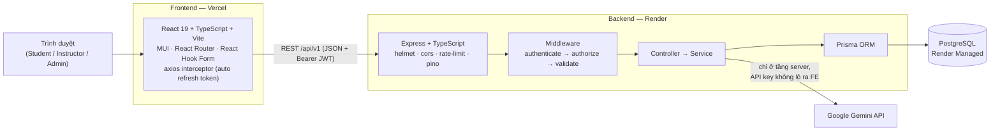
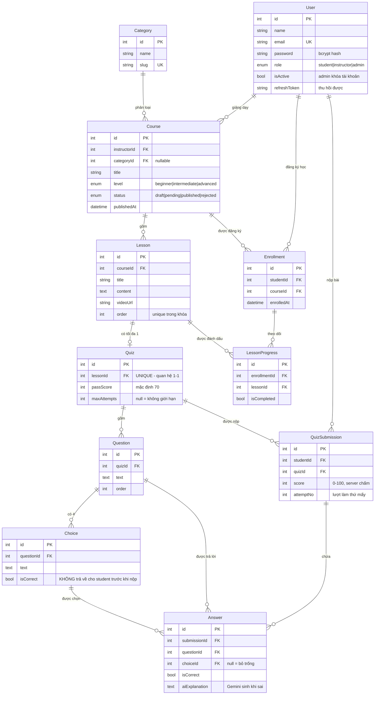

# ĐỒ ÁN TỐT NGHIỆP — LEARNQUIZ
### Nền Tảng Học Tập & Quiz Trực Tuyến

> **Đề tài số 4** — Lập trình Full-stack JavaScript, Khóa 312
> Trung Tâm Tin Học, Trường Đại học Khoa học Tự nhiên, ĐHQG-HCM

| Mục | Nội dung |
|---|---|
| **Tên hệ thống** | LearnQuiz |
| **Học viên thực hiện** | *(điền họ tên)* |
| **Giảng viên hướng dẫn** | *(điền tên GVHD)* |
| **Ngày lập tài liệu** | 14/08/2026 |
| **Phiên bản** | 2.0 — Hoàn tất toàn bộ 6 sprint |
| **Repository** | `FinalProject/` (monorepo: `backend/` + `frontend/`) |

---

## 1. Tóm tắt

LearnQuiz là nền tảng học trực tuyến quy mô nhỏ theo mô hình **ba vai trò**: giảng viên soạn khóa học gồm nhiều bài học kèm quiz trắc nghiệm, quản trị viên duyệt khóa học trước khi công khai, học viên đăng ký học, làm quiz và theo dõi tiến độ. Hệ thống được xây dựng theo kiến trúc **client–server tách rời**, giao tiếp qua **RESTful API** có phiên bản (`/api/v1`), xác thực bằng **JWT hai token**, và triển khai lên hạ tầng cloud (Vercel + Render).

Tài liệu này trình bày phạm vi, kiến trúc, mô hình dữ liệu, hợp đồng API và toàn bộ quá trình thực hiện qua sáu sprint — **tất cả đã hoàn tất**: nghiệp vụ đủ ba vai trò của đề tài, ba tính năng AI dùng Google Gemini, đóng gói Docker hai giai đoạn, tích hợp liên tục bằng GitHub Actions và cấu hình triển khai lên Render + Vercel. Bộ kiểm thử tự động gồm **318 phép khẳng định** chạy bằng `npm test`, hiện đạt 318/318. Hướng dẫn triển khai chi tiết ở [`DEPLOY.md`](DEPLOY.md).

---

## 2. Phạm vi và tiêu chí chấm điểm

Đề tài quy định thang điểm **10** phân bổ theo vai trò. Bảng dưới ánh xạ từng yêu cầu sang hạng mục kỹ thuật cụ thể và sprint sẽ thực hiện.

### 2.1. Student — 4.0 điểm

| # | Yêu cầu đề tài | Hạng mục kỹ thuật | Sprint |
|---|---|---|---|
| 1 | Xem danh sách khóa học, filter theo category / độ khó | `GET /courses` có query `category`, `level`, `search`, phân trang | 1 |
| 2 | Đăng ký (enroll) khóa học miễn phí | `POST /courses/:id/enroll`, ràng buộc `@@unique([studentId, courseId])` | 2 |
| 3 | Học từng bài theo thứ tự (video / text) | `order` duy nhất trong khóa; FE khóa bài chưa tới lượt | 2 |
| 4 | Đánh dấu bài học hoàn thành | `PATCH /lessons/:id/complete` → bảng `LessonProgress` | 2 |
| 5 | Làm quiz — chọn đáp án, nộp, xem điểm ngay | `POST /quiz/:id/submit`, **chấm điểm phía server** | 3 |
| 6 | Xem lại đáp án đúng / sai sau khi nộp | `GET /submissions/:id` trả `isCorrect` **chỉ sau khi đã nộp** | 3 |
| 7 | Xem tiến độ khóa học (% và điểm trung bình) | `GET /enrollments/me` tính tổng hợp bằng aggregate | 3 |
| 8 | Làm lại quiz nếu chưa đạt | `attemptNo` + `maxAttempts` + `passScore` | 3 |
| 9 | **AI:** giải thích đáp án sai | `POST /ai/explain-answer` → Gemini, lưu vào `Answer.aiExplanation` | 5 |

### 2.2. Instructor — 4.0 điểm

| # | Yêu cầu đề tài | Hạng mục kỹ thuật | Sprint |
|---|---|---|---|
| 1 | Tạo khóa học (tên, mô tả, category, thumbnail) | `POST /courses`, mặc định `status = draft` | 1 |
| 2 | Thêm bài học — **thứ tự quan trọng** | `POST /courses/:id/lessons`, `@@unique([courseId, order])` | 2 |
| 3 | Tạo quiz: câu hỏi, 4 đáp án, đánh dấu đáp án đúng | `POST /lessons/:id/quiz` ghi lồng `Question` + `Choice` trong transaction | 3 |
| 4 | Thống kê học viên: số enroll, điểm trung bình lớp | `GET /courses/:id/stats` dùng `groupBy` + `_avg` | 4 |
| 5 | Sửa / xóa bài học, câu hỏi | `PATCH` / `DELETE`, kiểm tra quyền sở hữu tài nguyên | 2–3 |

### 2.3. Admin — 2.0 điểm

| # | Yêu cầu đề tài | Hạng mục kỹ thuật | Sprint |
|---|---|---|---|
| 1 | Duyệt khóa học trước khi hiển thị public | `PATCH /courses/:id/publish` · `/reject`, máy trạng thái 4 bước | 4 |
| 2 | CRUD category | `/categories` đầy đủ 5 endpoint | 1 |
| 3 | Quản lý user (khóa tài khoản vi phạm) | `PATCH /users/:id/status` → cờ `isActive` chặn ngay ở tầng login | 4 |
| 4 | Thống kê tổng quan: khóa học nhiều học viên nhất | `GET /admin/stats` | 4 |

### 2.4. Ngoài phạm vi (tuyên bố rõ để bảo vệ)

Những mục sau **có chủ đích không làm**, vì không nằm trong yêu cầu đề tài và sẽ làm loãng trọng tâm:

- Thanh toán / khóa học trả phí — đề tài quy định *"đăng ký khóa học miễn phí"*.
- Upload và streaming video — bài học lưu **URL video** (YouTube/Vimeo), không tự host.
- Chat, diễn đàn, thông báo email — thuộc đề tài khác.
- Ứng dụng di động native — phạm vi là web responsive.
- Quiz dạng tự luận — đề tài quy định trắc nghiệm 4 đáp án.

---

## 3. Kiến trúc hệ thống



### 3.1. Luồng một request điển hình

`Request` → **helmet** (bảo mật header) → **cors** (kiểm tra origin) → **rate limit** → **requestLogger** (pino) → **authenticate** (giải mã JWT → `req.user`) → **authorize** (kiểm tra role) → **validate** (Yup, `stripUnknown`) → **controller** → **service** (nghiệp vụ thuần) → **Prisma** → PostgreSQL. Mọi lỗi trên đường đi đều được `next(err)` đưa về **một** `errorHandler` duy nhất ở cuối chuỗi.

Điểm mấu chốt của thiết kế này: **controller không chứa nghiệp vụ, service không biết gì về HTTP**. Nhờ đó service viết unit test được mà không cần dựng server.

### 3.2. Công nghệ và lý do lựa chọn

| Lớp | Công nghệ | Lý do |
|---|---|---|
| Ngôn ngữ | TypeScript (cả FE và BE) | Bắt lỗi kiểu ngay lúc biên dịch; dùng chung kiểu dữ liệu API giữa hai đầu |
| Backend | Node.js + Express 4 | Đúng yêu cầu đề tài; middleware chain rõ ràng, dễ trình bày |
| ORM | Prisma 5 | Schema là nguồn sự thật duy nhất; migration có phiên bản; type-safe |
| CSDL | PostgreSQL 16 | Quan hệ nhiều-nhiều và ràng buộc unique là trung tâm đề tài |
| Validate | Yup | Dùng **cùng một thư viện** ở cả FE và BE — quy tắc viết một lần, hiểu một kiểu |
| Auth | JWT (access + refresh) + bcrypt | Không cần lưu session phía server, phù hợp kiến trúc tách rời |
| Frontend | React 19 + Vite | Đúng yêu cầu đề tài; Vite build nhanh, HMR tức thì |
| UI | MUI v9 | Có sẵn component responsive, tập trung thời gian vào nghiệp vụ |
| Form | React Hook Form + Yup resolver | Uncontrolled → ít re-render; validate đồng bộ với backend |
| HTTP | axios | Interceptor để tự gắn token và tự làm mới khi 401 |
| Log | pino | Log JSON có cấu trúc, tự động che field nhạy cảm (`redact`) |
| Triển khai | Docker · Render · Vercel | Đúng yêu cầu đề tài; free tier đủ dùng cho demo |
| AI | Google Gemini | Đúng yêu cầu đề tài; gọi **chỉ từ backend** để không lộ API key |

---

## 4. Mô hình dữ liệu

### 4.1. Sơ đồ quan hệ thực thể



### 4.2. Năm quyết định thiết kế cần giải trình

**(1) `Quiz.lessonId` đặt `@unique` — quan hệ 1-1 do cơ sở dữ liệu bảo đảm.**
Đề tài quy định *"mỗi bài học tối đa 1 quiz"*. Nếu chỉ kiểm tra trong code, hai request đồng thời vẫn tạo được hai quiz. Ràng buộc `@unique` đẩy việc bảo đảm này xuống tầng CSDL — nơi duy nhất không thể bị vượt qua.

**(2) `@@unique([studentId, courseId])` trên `Enrollment` — chặn đăng ký trùng.**
Người dùng bấm nút "Đăng ký" hai lần rất nhanh sẽ tạo hai bản ghi nếu chỉ kiểm tra `findFirst` rồi `create`. Ràng buộc unique khiến lần thứ hai ném lỗi Prisma `P2002`, được `errorHandler` chuyển thành HTTP 409 với thông báo tiếng Việt.

**(3) `@@unique([courseId, order])` trên `Lesson` — thứ tự bài học là dữ liệu, không phải quy ước.**
Đề tài nhấn mạnh *"thứ tự bài học quan trọng"*. Ràng buộc này bảo đảm không tồn tại hai bài cùng số thứ tự trong một khóa.
*Hệ quả cần lưu ý:* khi đổi thứ tự hai bài, phải cập nhật trong một transaction qua giá trị trung gian (ví dụ dùng `order` âm tạm thời), nếu không sẽ vi phạm ràng buộc giữa chừng. Đây là đánh đổi có chủ đích: chấp nhận phức tạp hơn khi ghi, đổi lấy dữ liệu không bao giờ sai.

**(4) `Answer` lưu `choiceId` đã chọn, không lưu "đúng/sai" suy diễn lại.**
Nếu về sau giảng viên sửa đáp án đúng của câu hỏi, bài đã nộp trước đó vẫn giữ nguyên lựa chọn thật của học viên. Cột `isCorrect` là **ảnh chụp kết quả tại thời điểm chấm** — dữ liệu lịch sử được bảo toàn.

**(5) `Course.status` là máy trạng thái bốn bước, không phải cờ boolean.**
`draft → pending → published` (hoặc `rejected` rồi quay lại `draft`). Một cờ `isPublished` không diễn tả được trạng thái "đã gửi, đang chờ admin duyệt" — vốn chính là yêu cầu 2.3.1 của đề tài.

---

## 5. Hợp đồng API `v1`

Mọi response tuân theo **một** khuôn dạng duy nhất:

```jsonc
// Thành công
{ "success": true, "message": "…", "data": { }, "meta": { "page": 1, "total": 42 } }

// Thất bại
{ "success": false, "message": "Mô tả lỗi bằng tiếng Việt", "errors": { "email": "Email không đúng định dạng" } }
```

**Quy ước quyền:** `—` công khai · `🔒` cần đăng nhập · `S` student · `I` instructor · `A` admin

### 5.1. Xác thực — `/api/v1/auth` ✅ *đã xong Sprint 0*

| Method | Endpoint | Quyền | Mô tả |
|---|---|---|---|
| POST | `/auth/register` | — | Đăng ký; chỉ nhận role `student` hoặc `instructor` |
| POST | `/auth/login` | — | Trả `user` + `accessToken` (15 phút) + `refreshToken` (7 ngày) |
| POST | `/auth/refresh` | — | Cấp cặp token mới; đối chiếu với token đang lưu trong CSDL |
| POST | `/auth/logout` | 🔒 | Xóa `refreshToken` trong CSDL → token cũ mất hiệu lực ngay |
| GET | `/auth/me` | 🔒 | Thông tin tài khoản hiện tại (không bao giờ kèm mật khẩu) |

### 5.2. Danh mục & Khóa học ✅ *đã xong Sprint 1*

| Method | Endpoint | Quyền | Mô tả |
|---|---|---|---|
| GET | `/categories` | — | Danh sách danh mục kèm tổng số khóa học mỗi danh mục |
| POST | `/categories` | A | Tạo danh mục; bỏ trống `slug` thì server tự sinh từ tên tiếng Việt |
| PATCH | `/categories/:id` | A | Sửa tên / slug, kiểm tra trùng slug |
| DELETE | `/categories/:id` | A | Chặn 409 nếu danh mục còn khóa học |
| GET | `/courses` | — | Lọc `?category=&level=&search=&sort=&page=&limit=`; **luôn chỉ trả `published`** |
| GET | `/courses/mine` | I · A | Khóa học của tôi, mọi trạng thái |
| GET | `/courses/:id` | — | Chi tiết + danh sách tiêu đề bài học; khóa chưa duyệt chỉ chủ sở hữu và admin thấy |
| POST | `/courses` | I · A | Tạo khóa mới, `status` bị ép về `draft` |
| PATCH | `/courses/:id` | I (chủ sở hữu) · A | Sửa nội dung; **không đổi được `status` qua endpoint này** |
| POST | `/courses/:id/submit` | I (chủ sở hữu) · A | Gửi duyệt: `draft`/`rejected` → `pending`; chặn nếu khóa chưa có bài học |
| DELETE | `/courses/:id` | I (chủ sở hữu) · A | Chặn 409 nếu đã có học viên đăng ký |

### 5.3. Bài học & Tiến độ ✅ *đã xong Sprint 2*

| Method | Endpoint | Quyền | Mô tả |
|---|---|---|---|
| GET | `/courses/:id/lessons` | I (chủ sở hữu) · A | Bài học **kèm nội dung đầy đủ** — dùng cho màn hình soạn bài |
| POST | `/courses/:id/lessons` | I (chủ sở hữu) · A | Thêm bài học; bỏ trống `order` thì tự xếp vào cuối |
| PATCH | `/courses/:id/lessons/reorder` | I (chủ sở hữu) · A | Sắp xếp lại toàn bộ thứ tự — **transaction hai pha** |
| PATCH · DELETE | `/lessons/:id` | I (chủ sở hữu) · A | Sửa / xóa bài học |
| POST | `/courses/:id/enroll` | 🔒 | Đăng ký khóa miễn phí; chặn khóa chưa duyệt và chặn chính giảng viên của khóa |
| GET | `/enrollments/me` | 🔒 | Khóa đã đăng ký + số bài đã xong + `%` tiến độ |
| GET | `/courses/:id/learn` | 🔒 (đã enroll · chủ sở hữu · A) | **Một request** trả đủ: khóa học, danh sách bài, trạng thái hoàn thành, trạng thái mở khóa, `%` tiến độ |
| GET | `/lessons/:id` | 🔒 (đã enroll · chủ sở hữu · A) | Nội dung đầy đủ; chặn nếu bài chưa được mở khóa |
| PATCH | `/lessons/:id/complete` | 🔒 (đã enroll) | Đánh dấu / bỏ đánh dấu hoàn thành, trả về tiến độ mới |

### 5.4. Quiz ✅ *đã xong Sprint 3*

| Method | Endpoint | Quyền | Mô tả |
|---|---|---|---|
| GET | `/lessons/:id/quiz` | 🔒 (đã enroll · chủ sở hữu · A) | Lấy đề — **tuyệt đối không trả `isCorrect`**; chặn nếu bài chưa mở khóa |
| GET | `/lessons/:id/quiz/editor` | I (chủ sở hữu) · A | Đề **kèm đáp án đúng** cho màn hình soạn quiz |
| PUT | `/lessons/:id/quiz` | I (chủ sở hữu) · A | Tạo hoặc thay thế trọn gói bộ câu hỏi trong một transaction; **chặn 409 nếu đã có lượt nộp** |
| PATCH | `/quiz/:id` | I (chủ sở hữu) · A | Sửa tên / điểm đạt / số lượt — luôn cho phép |
| DELETE | `/quiz/:id` | I (chủ sở hữu) · A | Xóa quiz (kéo theo toàn bộ kết quả cũ) |
| POST | `/quiz/:id/submit` | 🔒 (đã enroll) | Nộp `[{questionId, choiceId}]`; **server chấm**, trả `score` + đáp án đúng |
| GET | `/quiz/:id/submissions/me` | 🔒 | Lịch sử các lượt làm bài của chính mình |
| GET | `/submissions/:id` | 🔒 (chủ nhân · giảng viên khóa · A) | Chi tiết bài đã nộp: từng câu đúng/sai |

### 5.5. Quản trị & Thống kê ✅ *đã xong Sprint 4*

| Method | Endpoint | Quyền | Mô tả |
|---|---|---|---|
| GET | `/admin/courses` | A | Hàng đợi duyệt: lọc `?status=&search=&page=`; trả kèm số đếm theo từng trạng thái; khóa chờ lâu nhất xếp đầu |
| PATCH | `/courses/:id/publish` | A | `pending → published`, ghi `publishedAt` |
| PATCH | `/courses/:id/reject` | A | `pending → rejected`; **bắt buộc `reason` ≥ 10 ký tự** |
| PATCH | `/courses/:id/unpublish` | A | `published → draft`; học viên đã đăng ký vẫn học tiếp được |
| GET | `/users` | A | Danh sách người dùng: lọc `?role=&isActive=&search=&page=`; **không bao giờ trả `password` / `refreshToken`** |
| PATCH | `/users/:id/status` | A | Khóa / mở tài khoản; thu hồi `refreshToken` khi khóa |
| GET | `/courses/:id/stats` | I (chủ sở hữu) · A | Số học viên, tiến độ trung bình, điểm trung bình và tỷ lệ đạt từng quiz |
| GET | `/admin/stats` | A | Tổng quan: người dùng theo vai trò, khóa học theo trạng thái, điểm trung bình, top 5 khóa nhiều học viên nhất |

### 5.6. Tính năng AI ✅ *đã xong Sprint 5*

| Method | Endpoint | Quyền | Mô tả |
|---|---|---|---|
| GET | `/ai/status` | 🔒 | Máy chủ đã cấu hình `GEMINI_API_KEY` chưa — giao diện dùng để bật/tắt các nút AI |
| POST | `/ai/lessons/:id/generate-quiz` | I (chủ sở hữu) · A | Gemini soạn **bản nháp** 1–10 câu trắc nghiệm từ nội dung bài học; **không tự lưu** |
| POST | `/ai/explain-answer` | 🔒 (chủ nhân bài làm) | Giải thích vì sao đáp án đã chọn là sai; **lưu lại** để lần sau không gọi AI nữa |
| POST | `/ai/lessons/:id/summarize` | 🔒 (đã enroll · chủ sở hữu) | Tóm tắt bài học thành 3–5 gạch đầu dòng |

> Toàn bộ nhánh `/ai` đi qua `aiLimiter` (10 request/phút/IP) vì Gemini tính tiền theo request. API key **chỉ tồn tại trong biến môi trường của backend** — mọi biến `VITE_*` đều lộ ra trình duyệt nên đặt key ở frontend là công khai khóa cho cả thế giới.
> Kết quả AI luôn hiển thị kèm ghi chú *"Nội dung do AI đề xuất, cần kiểm tra lại"*. Thiếu `GEMINI_API_KEY` thì hệ thống vẫn chạy bình thường, chỉ các nút AI bị làm mờ kèm giải thích — **suy giảm êm, không sập**.

---

## 6. Bốn quy tắc nghiệp vụ then chốt

**(1) Chấm điểm chỉ diễn ra ở server.** Endpoint `GET /lessons/:id/quiz` dùng `select` của Prisma để loại bỏ trường `isCorrect` trước khi trả về. Nếu để lọt, học viên mở tab Network của trình duyệt là thấy toàn bộ đáp án. Điểm số do backend tính từ `gradeQuiz` — một **hàm thuần** tách riêng ở `services/quizGrader.ts`; frontend chỉ gửi "câu nào chọn đáp án nào" và chỉ hiển thị kết quả.
Hai điều này được **kiểm chứng tự động**: bộ test gọi HTTP thật rồi khẳng định chuỗi `"isCorrect"` không xuất hiện trong phản hồi, và khẳng định request cố tình gửi kèm `score: 100` vẫn bị server chấm ra đúng điểm thật.

**(2) Nội dung bài học bị khóa nếu chưa đăng ký.** `GET /courses/:id` trả tiêu đề bài học cho mọi người, nhưng `content` và `videoUrl` chỉ trả khi có bản ghi `Enrollment` tương ứng. Việc kiểm tra nằm ở backend — ẩn bằng CSS ở frontend không phải là bảo mật.

**(3) Quyền sở hữu tài nguyên khác với quyền theo vai trò.** Một giảng viên có role `instructor` không được sửa khóa học của giảng viên khác. Ngoài `authorize("instructor")`, mỗi thao tác ghi còn phải đối chiếu `course.instructorId === req.user.id` (admin được miễn).

**(4) Tiến độ tính từ dữ liệu, không lưu sẵn.** `%` hoàn thành = `số LessonProgress đã completed / tổng số Lesson của khóa`. Không lưu cột `progressPercent` để tránh dữ liệu lệch khi giảng viên thêm bài học mới.

**(5) Lộ trình học tuần tự do server quyết định.** Bài đầu tiên luôn mở; bài thứ N chỉ mở khi **tất cả** các bài đứng trước đã hoàn thành. Hàm `computeUnlock` là một hàm thuần (không đụng CSDL, không đụng HTTP) nên kiểm thử được độc lập, và được gọi ở **hai chỗ**: khi dựng danh sách bài học và khi trả nội dung một bài cụ thể — nên gọi thẳng `GET /lessons/:id` bằng Postman cũng không vượt qua được khóa lộ trình.

**(6) Vòng đời khóa học là một máy trạng thái, không phải chuỗi if/else rải rác.** Toàn bộ luật chuyển trạng thái nằm trong `services/courseWorkflow.ts` — một bảng khai báo bốn thao tác (`submit`, `publish`, `reject`, `unpublish`) với danh sách trạng thái nguồn hợp lệ. Cả `courseService` (giảng viên gửi duyệt) và `adminService` (quản trị duyệt/từ chối/gỡ) đều gọi cùng bảng đó, nên không thể xảy ra cảnh hai nơi hiểu luật khác nhau. Đủ **16 tổ hợp** trạng thái × thao tác được kiểm thử.

**(7) Hai lớp chống khóa sập hệ thống quản trị.** Quản trị viên không khóa được chính mình, và không khóa được quản trị viên đang hoạt động **cuối cùng**. Lớp thứ hai không thừa: nếu quản trị B vừa khóa quản trị A, mà A còn giữ access token chưa hết hạn thì A vẫn kịp khóa ngược B — hệ thống mất sạch quản trị viên. Tình huống này được tái hiện nguyên văn trong bộ kiểm thử.

**(8) Đầu ra của AI đi qua đúng bộ kiểm tra như dữ liệu người dùng nhập tay.** Câu hỏi do Gemini sinh ra được validate bằng chính `questionSchema` dùng cho giảng viên gõ tay — đúng 4 đáp án, đúng 1 đáp án đúng, độ dài tối thiểu. AI cũng chỉ là một nguồn đầu vào không đáng tin, không được hưởng ngoại lệ nào. Ngoài ra AI **không tự ghi vào cơ sở dữ liệu**: kết quả trả về giao diện để giảng viên đọc, sửa rồi mới bấm lưu qua endpoint soạn quiz thông thường.

---

## 7. Bảo mật

| Rủi ro | Biện pháp đã áp dụng |
|---|---|
| Lộ mật khẩu khi cơ sở dữ liệu bị rò rỉ | `bcrypt` với 10 vòng salt; mật khẩu không bao giờ nằm trong response |
| Dò mật khẩu tự động (brute force) | `express-rate-limit`: 20 lần/15 phút cho `/auth/*` |
| Đánh cắp token | Access token sống 15 phút; refresh token lưu trong CSDL nên **thu hồi được** |
| Dò email tồn tại trong hệ thống | Sai email và sai mật khẩu trả **cùng một** thông báo |
| Mass assignment (gửi thừa trường `role: "admin"`) | Yup `stripUnknown` loại field lạ; `/auth/register` chỉ chấp nhận `student`/`instructor` |
| SQL Injection | Prisma dùng tham số hóa truy vấn; không nối chuỗi SQL |
| XSS / clickjacking | `helmet()` đặt CSP, `X-Frame-Options`, `X-Content-Type-Options` |
| Gọi API từ tên miền lạ | CORS whitelist đúng `FE_URL` |
| Lộ khóa bí mật | `.env` nằm trong `.gitignore`; secret cấu hình qua biến môi trường của Render |
| Lộ dữ liệu nhạy cảm qua log | `pino` cấu hình `redact` tự động che `password`, `authorization`, `token` |
| Tài khoản vi phạm vẫn dùng được | Cờ `isActive` kiểm tra ngay tại `login` **và** `refresh` |

---

## 8. Kế hoạch thực hiện

| Sprint | Nội dung | Kết quả bàn giao | Trạng thái |
|---|---|---|---|
| **0** | Khung dự án, lược đồ CSDL, xác thực & phân quyền | Monorepo chạy được; 11 bảng; đăng ký/đăng nhập/refresh/logout/me; `ProtectedRoute` theo role; seed 5 tài khoản | ✅ **Hoàn tất** |
| **1** | Danh mục & Khóa học | CRUD category (admin), CRUD course + gửi duyệt (instructor), trang danh sách có lọc theo danh mục/độ khó/từ khóa + sắp xếp + phân trang, trang chi tiết khóa học | ✅ **Hoàn tất** |
| **2** | Bài học, Đăng ký học, Tiến độ | Màn hình soạn bài học + sắp xếp thứ tự, đăng ký khóa, màn hình học bài có thanh bên, khóa bài theo lộ trình, đánh dấu hoàn thành, thanh tiến độ | ✅ **Hoàn tất** |
| **3** | Quiz — trái tim của đề tài | Trình soạn quiz động, làm bài, chấm điểm phía server, xem lại đáp án đúng/sai, giới hạn số lượt làm lại, khóa sửa đề sau khi có bài nộp, **bộ kiểm thử 111 phép** | ✅ **Hoàn tất** |
| **4** | Quản trị & Thống kê | Máy trạng thái duyệt khóa học (duyệt/từ chối/gỡ), quản lý người dùng có hai lớp chống tự khóa hệ thống, trang tổng quan và trang thống kê lớp học dùng `groupBy` + `_avg` | ✅ **Hoàn tất** |
| **5** | Tích hợp AI + Triển khai | Ba tính năng Gemini (sinh câu hỏi, giải thích đáp án sai, tóm tắt bài học), Docker hai giai đoạn, GitHub Actions CI, `render.yaml`, `vercel.json`, tài liệu triển khai | ✅ **Hoàn tất** |

**Định nghĩa "hoàn thành" cho mỗi sprint:** `npm run build` sạch lỗi ở cả hai dự án · mọi endpoint mới đã thử bằng Postman · không còn `console.log` sót lại · đã commit lên nhánh riêng và merge vào `main`.

---

## 9. Checklist nghiệm thu Production *(theo Bài 11 — Capstone Prep)*

**Hạ tầng** — FE Vercel tải được, không lỗi CORS · BE `/health` trả `{"status":"ok"}` · migration đã áp dụng, seed đủ dữ liệu · `FE_URL` đã whitelist · không biến môi trường nào còn trỏ `localhost`.

**Bảo mật** — `git log --all --full-history -- .env` cho kết quả rỗng · `npm audit` không còn lỗ hổng critical/high · `helmet()` đã bật · rate limit cho `/auth/*` và `/ai/*` · không response nào chứa `password` hay `refreshToken` · `NODE_ENV=production` trên Render.

**Chất lượng mã** — không còn `console.log` rải rác · không dùng `any` vô cớ · mọi route async đều `try/catch` + `next(err)` · `npm run build` sạch lỗi ở cả hai dự án · `npm test` đạt 318/318.

**Quan sát được** — pino log JSON có `redact` · `requestLogger` ghi method, path, status, thời gian xử lý · log forward sang Better Stack.

---

## 9bis. Kiểm thử tự động

Chạy toàn bộ bằng `cd backend && npm test`. Không cần cơ sở dữ liệu: tầng Prisma được thay bằng một bản giả lập trong bộ nhớ **có tôn trọng `select`/`include`** — nhờ vậy phép thử "không rò rỉ đáp án" mới có giá trị thật.

| Tệp | Nội dung kiểm | Số phép |
|---|---|---|
| `tests/grader.test.ts` | Luật chấm điểm và luật mở khóa bài học (hàm thuần) | 24 |
| `tests/workflow.test.ts` | Máy trạng thái khóa học — đủ 16 tổ hợp trạng thái × thao tác | 30 |
| `tests/schema.test.ts` | Luật ra đề, luật nộp bài, bộ lọc quản trị, chống mass-assignment | 31 |
| `tests/quizService.test.ts` | Nghiệp vụ quiz đầu-cuối: phân quyền, chấm điểm, giới hạn lượt, khóa sửa đề | 47 |
| `tests/gemini.test.ts` | Lớp gọi Gemini: JSON, lỗi mạng, quá thời gian, không lộ chi tiết lỗi | 18 |
| `tests/adminService.test.ts` | Duyệt khóa học, quản lý người dùng, toàn bộ số liệu thống kê | 75 |
| `tests/aiService.test.ts` | Ba tính năng AI: phân quyền, kiểm duyệt đầu ra, bộ nhớ đệm | 36 |
| `tests/api.test.ts` | Bảng định tuyến thật + gọi HTTP qua toàn bộ chuỗi middleware | 57 |
| **Tổng** | | **318** |

Năm khẳng định quan trọng nhất mà bộ test bảo vệ:

1. Phản hồi HTTP thật của `GET /lessons/:id/quiz` **không chứa chuỗi `isCorrect`**.
2. Gửi kèm `score: 100` khi nộp bài thì server **vẫn tự chấm ra điểm thật** (0 điểm nếu sai).
3. Chọn `choiceId` của câu hỏi khác thì **không ăn điểm**, được ghi nhận là bỏ trống.
4. Phản hồi của `GET /users` **không chứa `password` hay `refreshToken`**.
5. Giảng viên gọi `PATCH /courses/:id/publish` cho chính khóa của mình vẫn nhận **403** — không ai tự duyệt được bài của mình.
6. AI trả về câu hỏi có 3 đáp án, hoặc 2 đáp án đúng, đều **bị chặn 422** trước khi đến tay giảng viên.
7. Lần thứ hai xin giải thích cùng một câu **không gọi lại Gemini** — lấy từ bản đã lưu.

## 10. Rủi ro và phương án dự phòng

| Rủi ro | Ảnh hưởng | Phương án |
|---|---|---|
| Render free tier "ngủ đông" sau 15 phút không dùng | Request đầu tiên khi demo chờ ~50 giây | Ping `/health` bằng UptimeRobot trước buổi bảo vệ 30 phút |
| Gemini API hết hạn mức hoặc lỗi mạng | Tính năng AI chết giữa buổi demo | Bắt lỗi và trả thông báo thân thiện; chuẩn bị sẵn ảnh chụp kết quả AI dự phòng |
| Đổi thứ tự bài học vi phạm `@@unique([courseId, order])` | Lỗi 409 khi kéo thả | Cập nhật trong transaction, đi qua giá trị `order` âm tạm thời |
| Sprint 3 (quiz) là phần phức tạp nhất | Trễ tiến độ toàn đồ án | Đặt Sprint 3 vào giữa kế hoạch, còn hai sprint đệm phía sau |
| Quên `npx prisma migrate deploy` khi deploy | API 500 vì bảng chưa tồn tại | Đưa lệnh vào Build Command của Render |

---

## 11. Hướng dẫn chạy dự án

### Yêu cầu môi trường
Node.js ≥ 20 · npm ≥ 10 · Docker Desktop (hoặc PostgreSQL 16 cài sẵn) · Git

### Bước 1 — Khởi động cơ sở dữ liệu
```bash
docker compose up -d          # Postgres tại cổng 5432, Adminer tại http://localhost:8080
```

### Bước 2 — Backend
```bash
cd backend
copy .env.example .env        # Windows  (macOS/Linux: cp .env.example .env)
npm install
npx prisma migrate dev --name init   # tạo bảng
npm run seed                          # nạp dữ liệu mẫu
npm run dev                           # http://localhost:3000
```
Kiểm tra: mở `http://localhost:3000/health` → `{"status":"ok","db":"up"}`

### Bước 3 — Frontend
```bash
cd frontend
copy .env.example .env
npm install
npm run dev                   # http://localhost:5173
```

### Tài khoản demo *(mật khẩu chung: `123456`)*

| Vai trò | Email |
|---|---|
| Quản trị | `admin@learnquiz.vn` |
| Giảng viên | `instructor@learnquiz.vn` |
| Giảng viên 2 | `instructor2@learnquiz.vn` |
| Học viên | `student@learnquiz.vn` |
| Học viên 2 | `student2@learnquiz.vn` |

---

## 12. Kịch bản demo khi bảo vệ *(dự kiến 8 phút)*

1. **Học viên** đăng nhập → duyệt danh sách khóa học → lọc theo danh mục và độ khó → đăng ký khóa "JavaScript căn bản".
2. Học bài 1 → đánh dấu hoàn thành → thanh tiến độ nhảy lên 33%.
3. Làm quiz → cố tình chọn sai một câu → nộp bài → xem điểm và đáp án đúng → **bấm "Vì sao sai?" để Gemini giải thích**.
4. **Giảng viên** đăng nhập → dán nội dung bài học → **Gemini sinh 5 câu hỏi** → sửa lại một câu → lưu → xem thống kê lớp.
5. **Quản trị** đăng nhập → duyệt khóa "PostgreSQL và Prisma ORM" đang chờ → khóa học xuất hiện public ngay lập tức.
6. Mở tab Network chứng minh response của `GET /lessons/:id/quiz` **không hề chứa trường `isCorrect`**.
7. Mở `/health` và bảng log trên Better Stack để chứng minh hệ thống quan sát được.

---

## 13. Cấu trúc thư mục

```
FinalProject/
├─ docker-compose.yml          # PostgreSQL 16 + Adminer cho môi trường dev
├─ docker-compose.full.yml     # chạy trọn bộ backend + frontend + CSDL bằng Docker
├─ render.yaml                 # bản thiết kế hạ tầng cho Render (Blueprint)
├─ .github/workflows/ci.yml    # tích hợp liên tục: typecheck · test · build · rà bảo mật
├─ docs/
│  ├─ DE-AN.md                 # ← tài liệu này
│  └─ DEPLOY.md                # hướng dẫn triển khai Render + Vercel từng bước
├─ backend/
│  ├─ prisma/
│  │  ├─ schema.prisma         # 11 model, 3 enum — nguồn sự thật của CSDL
│  │  └─ seed.ts               # 5 tài khoản, 4 danh mục, 3 khóa học, 5 quiz
│  ├─ src/
│  │  ├─ config/env.ts         # đọc & kiểm tra biến môi trường lúc khởi động
│  │  ├─ middleware/           # authenticate · authorize · validate · validateId · rateLimiter · errorHandler
│  │  ├─ schemas/              # auth · category · course · lesson · quiz · admin · ai — validate bằng Yup
│  │  ├─ services/             # nghiệp vụ; quizGrader · lessonRules · courseWorkflow là HÀM THUẦN
│  │  │                        # geminiClient · aiService — mọi lời gọi AI chỉ ở tầng server
│  │  ├─ controllers/          # nhận request, gọi service, trả response
│  │  ├─ routes/               # khai báo endpoint + chuỗi middleware
│  │  ├─ utils/                # prisma · jwt · logger · slugify
│  │  ├─ app.ts                # lắp ráp Express
│  │  └─ index.ts              # khởi động server + tắt an toàn
│  ├─ tests/                   # 318 phép kiểm, chạy bằng `npm test`, không cần CSDL
│  └─ Dockerfile               # build hai tầng, image gọn cho production
└─ frontend/
   ├─ vercel.json            # rewrite cho SPA: mọi đường dẫn trả index.html
   ├─ Dockerfile · nginx.conf # build tĩnh rồi phục vụ bằng nginx
   └─ src/
      ├─ api/                  # axiosClient (tự refresh token) · auth · category · course · lesson · enrollment · quiz · admin · ai
      ├─ hooks/                # useAiStatus — hỏi một lần, dùng chung mọi màn hình
      ├─ context/              # AuthContext — trạng thái đăng nhập toàn cục
      ├─ router/               # khai báo route · ProtectedRoute theo role
      ├─ components/layout/    # Header · MainLayout
      ├─ components/course/    # CourseCard
      ├─ components/common/    # ConfirmDialog
      ├─ pages/                # công khai · MyCoursesPage · LearnPage · QuizPage · QuizResultPage
      ├─ pages/instructor/     # InstructorCoursesPage · CourseFormPage · LessonEditorPage · QuizEditorPage · CourseStatsPage
      ├─ pages/admin/          # AdminDashboardPage · AdminCoursesPage · AdminUsersPage · AdminCategoriesPage
      ├─ types/ · utils/       # kiểu dữ liệu API · xử lý lỗi
      └─ theme/                # cấu hình MUI
```

---

*Tài liệu kết thúc — LearnQuiz v2.0, hoàn tất toàn bộ 6 sprint ngày 16/08/2026.*
